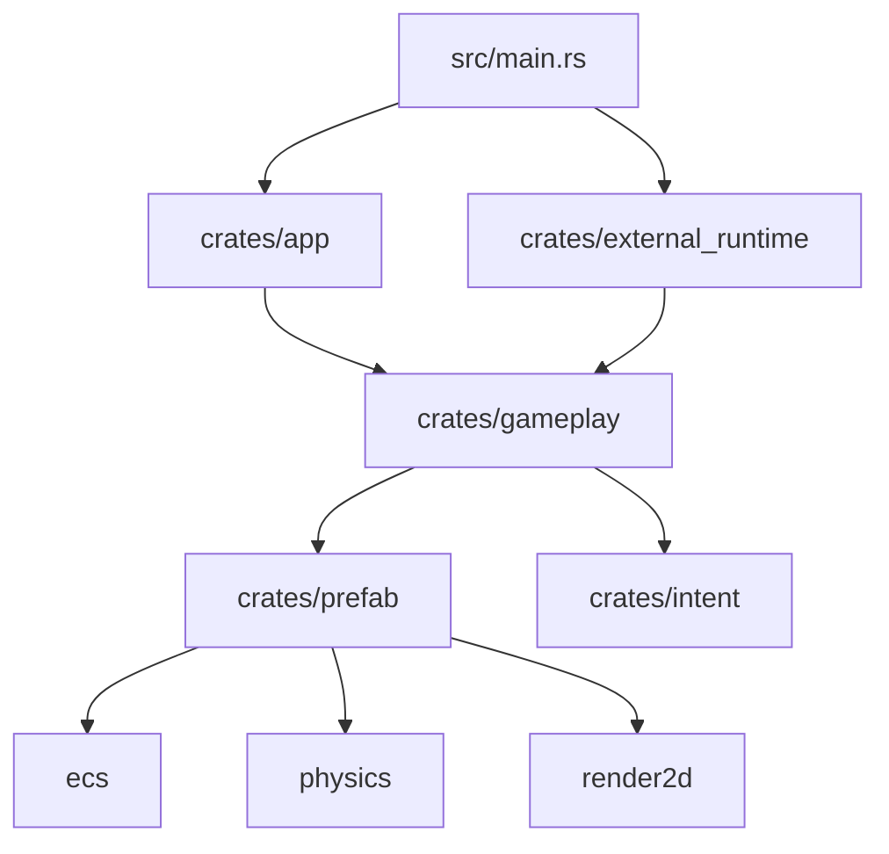

# Bevy 游戏模板

一个为 Bevy 游戏开发准备的工作区模板。

这个模板的目标不是发布到 crates.io，而是作为 GitHub 模板或本地工作区使用。项目默认先实现 2D 游戏结构，同时预留独立的 3D 渲染层。

## 设计目标

- 使用 Cargo 工作区拆分职责。
- 让后续开发有明确的代码落点，不把 ECS、玩法、渲染和应用组装混在一起。
- 默认 app 使用 2D 渲染层。
- 3D 渲染层独立存在，需要时再接入 app。
- 全项目统一使用 `error::Result<T>` 和 `error::GameError`。
- `error::GameError` 使用 `thiserror` 定义，外部错误转换统一在 `crates/error` 中添加。
- 所有子包都设置 `publish = false`，只从 GitHub 或本地路径加载。

## 工作区结构

这是模板默认结构，不是固定不变的最终架构。

实际项目可以根据游戏类型和团队习惯添加、修改或删除目录。比如某个游戏不需要 3D，可以长期不接入 `render_3d`；如果物品系统很复杂，也可以继续在 `crates/ecs/src/components/items` 或其他合适位置细分模块。

调整目录时需要保持一个原则：目录名称应该表达清楚职责，代码应该放在最容易理解和维护的位置。修改结构后，也应该同步更新相关文档，避免后续开发继续按照旧路径写代码。

- `crates/error`: 统一错误、Result、错误类型和严重级别
- `crates/ecs`: Bevy ECS 核心层，包含组件、资源、事件和系统函数
- `crates/external_runtime`: Bevy App 外部 runtime，持有 manager API，运行 input/local、input/device、input/ai 等外部来源
- `crates/intent`: Entity 意图层，表达可控制实体想做什么
- `crates/gameplay`: 游戏玩法语义层，负责状态流、gameplay session 生命周期和 ECS system 调度
- `crates/physics`: 物理引擎适配层，默认使用 Avian 2D，可通过 feature 切换到 Rapier 2D
- `crates/prefab`: 可生成对象模板基础库，组合 ECS、physics、render 数据
- `crates/render_2d`: 2D 渲染和表现层，包含 2D 相机、屏幕、界面、精灵等
- `crates/render_3d`: 3D 渲染和表现层，包含 3D 相机、场景、3D 界面等
- `crates/app`: Bevy App 子包，负责组装 Bevy 外壳和 `GameplayPlugin`
- `src/main.rs`: 工作区根入口，同时启动 `external_runtime` 和 Bevy App
- `assets`: Bevy 运行时资源目录，模板默认只保留空目录
- `docs`: 设计文档、AI 任务说明、开发决策
- `tools`: 本地辅助脚本

## 默认组装

当前默认 app 组装：

```rust
GameplayPlugin
```

`src/main.rs` 会先创建 `external_runtime::manager::ExternalRuntimeManager`，再从 manager 取 Bevy App 需要的 inbox/update sender，然后启动两套系统：

```text
external_runtime
Bevy App
```

`external_runtime` 持有有状态的 manager API，把 Bevy App 外部的 input/local、input/device、input/ai 等来源转换成 gameplay 请求。普通用户代码通过 manager 查询公开 entity id，不接触 Bevy `Entity`。

`GameplayPlugin` 是注册到 Bevy App 的玩法流程入口，负责状态、spawn、request 消费和 gameplay systems 的调度。

## crate 关系

下面是当前模板的默认层次关系：



`app` 依赖 `gameplay` 是因为游戏玩法层需要注册到 Bevy App。这里的 `app -> gameplay` 只表示：

```rust
app.add_plugins(GameplayPlugin)
```

它不表示 app 负责外部输入、意图、物理规则，也不表示 app 会直接创建刚体、碰撞体或渲染对象。app 只配置 Bevy 外壳；gameplay session 生命周期、对象生成时机和系统调度都放在 `gameplay`。

`external_runtime -> gameplay` 表示外部 runtime 持有 manager API，并通过 gameplay 的 API 边界向 Bevy App 提交请求。普通用户代码不应该直接关心 Bevy `Entity`。

`error` 是全项目共享基础层。所有 crate 都使用 `error::Result<T>` 和 `error::GameError`，不要在其它 crate 里定义新的 `Result` 别名，也不要直接使用 Rust 默认的 `std::result::Result` 作为项目函数返回类型。

## 分层规则

下面是模板默认规则，可以按项目需求调整。调整时优先保持职责清晰，而不是机械保留所有目录。

- `crates/ecs/src/components` 放组件、bundle、marker 等挂在实体上的数据定义。
- `crates/ecs/src/resources` 放 Bevy ECS 全局 Resource 数据。
- `crates/ecs/src/events` 放 ECS 事件数据。
- `crates/ecs/src/systems` 放真正读取和修改 ECS 数据的系统函数。
- `gameplay` 负责状态流、阶段调度、gameplay session 生命周期、request 消费和 ECS system 调度。
- `external_runtime` 运行 Bevy App 外部的 loop，持有 manager API，并把 input/local、input/device、input/ai 等来源转换成 gameplay 请求。
- `intent` 只表达哪个 Entity 想做什么，并通过 `prefab` 暴露的最小合法接口写入意图数据；可接收 intent 的对象由 `prefab` 组合对应组件。
- `physics` 对外提供统一物理 API，内部通过 feature 选择物理后端。
- `prefab` 负责组合 `ecs`、`physics`、`render_2d` 等基础库，提供可直接生成的完整对象模板和面向 gameplay 的封装入口。
- `render_2d` 只放 2D 表现相关代码，可以创建相机、sprite、UI 和渲染专用子实体，但不能驱动 gameplay 规则。
- `render_3d` 只放 3D 表现相关代码。
- `app` 只负责 Bevy 外壳、窗口等顶层配置，并注册唯一游戏玩法入口 `GameplayPlugin`。
- 可失败的项目函数统一返回 `error::Result<T>`。
- 每个非 `error` 子包都会把它重新导出为本子包的 `Result`。
- 不要在功能子包里自己定义新的 `Result` 别名。
- 不要给子包加 `game_` 前缀，这个仓库本身就是游戏模板。

## 常用命令

运行：

```sh
cargo run
```

检查：

```sh
cargo fmt --check
cargo check --workspace
cargo run -p xtask -- check
```

格式化：

```sh
cargo fmt
```

使用 Rapier 2D 物理后端：

```sh
cargo run --features physics/rapier2d
```

## 协作规则

如果使用 AI 代理辅助开发，可以阅读根目录 `AI_PROTOCOL/` 下对应 crate 的规则文件。

约定：普通 `README.md` 写给人看；`AI_PROTOCOL` 目录下的大写文件写给 AI 看。
